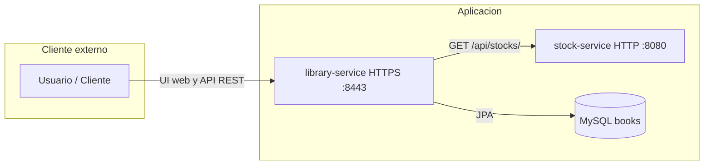

# Ejemplo Práctica 3

Ejemplo que contiene una evolución de la práctica anterior con dos servicios independientes:

* `library-service`: aplicación web y API REST para gestionar libros, imágenes, tiendas y autenticación.
* `stock-service`: servicio auxiliar que devuelve el stock asociado a un libro.

## Diagrama de servicios



## Requisitos previos

El proyecto necesita una base de datos MySQL disponible en `localhost` con esta configuración:

* Esquema: `books`
* Usuario: `root`
* Contraseña: `password`

Se puede arrancar con Docker:

```sh
docker run --rm -e MYSQL_ROOT_PASSWORD=password -e MYSQL_DATABASE=books -p 3306:3306 -d mysql:9.2
```

## library-service

Es la aplicación principal del ejemplo. Incluye:

* Interfaz web con Spring MVC y templates Mustache.
* Persistencia en MySQL.
* Gestión de imágenes en base de datos.
* Seguridad con HTTPS y usuarios con roles.

A la que se le ha añadido:

* API REST para libros, tiendas, imágenes y autenticación.
* Consulta al `stock-service` para mostrar el stock de cada libro.

### Arranque

Desde el directorio `ejemplo-practica3/library-service`:

```sh
mvn spring-boot:run
```

### Configuración de stock-service por variable de entorno

`library-service` usa la propiedad `stock.service.url` para conectar con `stock-service`.
Esa propiedad se puede configurar con la variable de entorno `STOCK_SERVICE_URL`.

Valor por defecto:

```text
http://localhost:8080
```

Ejemplo de arranque con variable de entorno:

```sh
STOCK_SERVICE_URL=http://localhost:8080 mvn spring-boot:run
```

La aplicación se expone en:

* Web: [https://localhost:8443](https://localhost:8443)
* API REST base: [https://localhost:8443/api/](https://localhost:8443/api/)
* Endpoints principales: `books`, `shops`, `images`, `users` y `auth`

### Usuarios

* Usuario: `user`, contraseña: `pass`
* Usuario: `admin`, contraseña: `adminpass`

### OpenAPI

Para generar la documentación con OpenAPI usando HTTPS, primero hay que disponer de un certificado autofirmado en `src/main/resources/keystore.jks`. Un ejemplo de generación es:

```sh
keytool -genkeypair -alias selfsigned -keyalg RSA -keysize 2048 -validity 365 -keystore keystore.jks -storetype PKCS12 -storepass password -keypass password -dname "CN=localhost, OU=Dev, O=URJC, L=Madrid, ST=Spain, C=ES"
```

Después se puede generar la documentación con:

```sh
mvn verify -Djavax.net.ssl.trustStore=src/main/resources/keystore.jks -Djavax.net.ssl.trustStorePassword=password
```

La documentación se puede consultar en:

* [Especificación OpenAPI de library-service](https://rawcdn.githack.com/codigus-formacion/ssdd-public/refs/heads/master/ejemplo-practica3/library-service/api-docs/api-docs.yaml)
* [HTML OpenAPI de library-service](https://rawcdn.githack.com/codigus-formacion/ssdd-public/refs/heads/master/ejemplo-practica3/library-service/api-docs/api-docs.html)

## stock-service

Servicio auxiliar que devuelve el stock de un libro a partir de un `BookBasicDTO` con su identificador y título. El valor de stock se genera de forma aleatoria para simular una respuesta externa.

### Arranque

Desde el directorio `ejemplo-practica3/stock-service`:

```sh
mvn spring-boot:run
```

El servicio escucha en:

* [http://localhost:8080](http://localhost:8080)

### Endpoint

* `GET /api/stocks/` recibiendo un `BookBasicDTO` en el body como JSON con `id` y `title`.

Ejemplo de uso:

```sh
curl -X GET "http://localhost:8080/api/stocks/" \
	-H "Content-Type: application/json" \
	-d '{"id":1,"title":"Clean Code"}'
```

### OpenAPI

Para generar la documentación con OpenAPI:

```sh
mvn verify
```

La documentación generada queda en:

* [Especificación OpenAPI de stock-service](https://rawcdn.githack.com/codigus-formacion/ssdd-public/refs/heads/master/ejemplo-practica3/stock-service/api-docs/api-docs.yaml)
* [HTML OpenAPI de stock-service](https://rawcdn.githack.com/codigus-formacion/ssdd-public/refs/heads/master/ejemplo-practica3/stock-service/api-docs/api-docs.html)

## Arranque completo

El orden recomendado para levantar el ejemplo es:

1. Iniciar MySQL.
2. Arrancar `stock-service`.
3. Arrancar `library-service`.

Con eso, la aplicación web podrá mostrar el stock de cada libro y la API REST permitirá consultarlo mediante el endpoint `GET /api/books/{id}/stock`.
